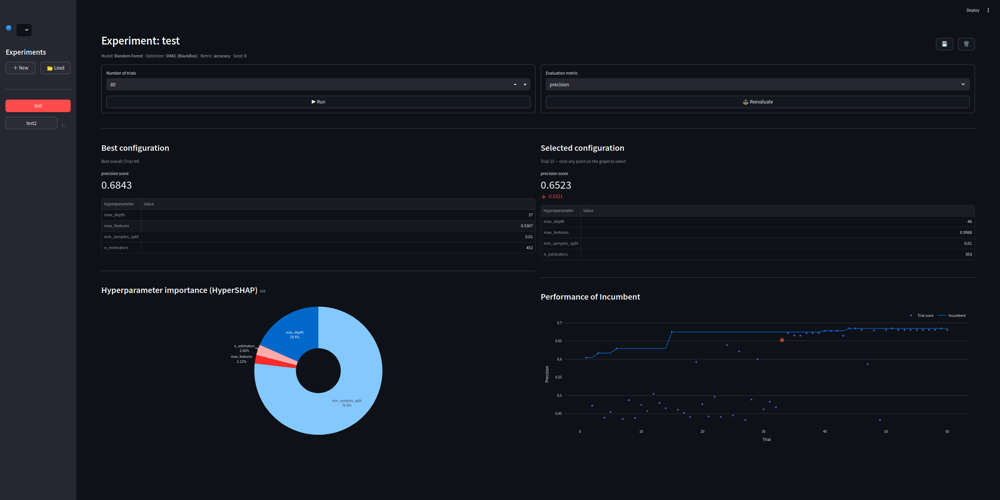

# Interactive HPO


InteractiveHPO is a workbench for intuitively performing hyperparameter optimization on arbitrary models and datasets.
It includes multiple metrics analytics tools for interpretability.



---

## Quick start

Python 3.11+ is required.  See [requirements.txt](requirements.txt) for dependencies.

---

### Option 1: Install from GitHub

Install `ihpo` as a command line interface:

```bash
pip install git+https://github.com/angrinord/InteractiveHPO.git
```

To run, call `ihpo` from the command line, then open [http://localhost:8501](http://localhost:8501) in your browser.

---

### Option 2: Run from source

First, clone the repo:

```bash
git clone https://github.com/angrinord/InteractiveHPO.git
cd InteractiveHPO
```

Then install dependencies and launch using your preferred environment manager:

**pip**
```bash
# Recommended to use venv
python -m venv .venv
source .venv/bin/activate    # Windows: .venv\Scripts\activate

pip install -r requirements.txt
streamlit run run.py
```

**conda**
```bash
conda create -n ihpo python=3.12
conda activate ihpo
pip install -r requirements.txt
streamlit run run.py
```

> **Note:** `smac` and `hypershap` are not available on conda-forge, so `pip install` is still required in conda.

> **Note:** It seems `smac` still has a dependency on `pyrfr` that is causing issues.  Must investigate further...

Then open [http://localhost:8501](http://localhost:8501) in your browser.

---

### Option 3: Docker

> **Why is there a `.whl` file in the repo?**
> `pyrfr` requires a C/SWIG extension that fails to compile
> under recent Debian/Ubuntu images.  A wheel pre-compiled against GCC 9
> is included so the Docker image can be built without a toolchain or source patches.
> It targets CPython 3.12 on Linux x86-64, matching the `python:3.12-slim` base image.

```bash
docker build -t interactivehpo .
docker run -d -p 8501:8501 \
  -v /path/to/your/data:/app/datasets \
  -v /path/to/your/models:/app/models \
  interactivehpo
```

Then open [http://localhost:8501](http://localhost:8501) in your browser.

- Replace `/path/to/your/data` with a folder of CSV files - they appear automatically in the **Dataset** dropdown alongside the bundled iris and wine datasets.
- Replace `/path/to/your/models` with a folder of `.py` model files - they appear automatically in the **Model** dropdown when not using the built-in demo models.

Either or both `-v` flags can be omitted if you don't need custom data or models.

> **Note:** File browser dialogs are disabled in headless mode. You must mount files as shown above.

---

## Usage

### Creating an experiment
After opening IHPO in your browser, click the "New" button in the sidebar to create a new experiment.
Select your preferred optimizer (currently implements SMAC, Random Search, and Grid Search) as well as a dataset and classifier model.
The dataset must be a CSV and the classifier must implement the BaseModel interface.
You can check the checkboxes to use demo datasets(iris and wine quality) and/or models (SVM and Random Forest) instead.
Choose a unique name for your experiment as well as a seed if you prefer.  When you're satisfied, click create.

> **Note:** There is currently no support for adding additional dependencies beyond those in the readme. If your model implementation has unmet dependencies you must install the dependencies yourself.


---
### Running an experiment

After creating your experiment, choose a number of trials for your hyperparameter configurations and a metric by which to evaluate them (accuracy, f1, precision, recall).
You can choose to perform additional trials later, and you can change your evaluation metric at any time.
If you choose to change your evaluation metric and then run additional trials you will be prompted if you want to use the new evaluation metric for the new trials.
If you do this, you may lose the ability to recreate your experiment using the same seed if your optimizer depends on that metric(SMAC).
After you begin running your experiment, you can continue to use the application.
The HPO runs in a different thread.

---
### Evaluating an experiment

After running a number of trials, IHPO will display the best performing hyperparameter configuration of your model, evaluated against your chosen metric.
It will also show the HyperSHAP values for each of your hyperparameters, and the relative performance of each trial compared to the performance of the incumbent hp configuration.
You can select any one of the trials by clicking on it in the graph, and compare the relative performance of your selected configuration.

You can save any experiment's data using the save button, and load it back into IHPO using the load button.
These .ihpo files are plaintext json for easy readability.

---

## Design Decisions
The design decisions are split into functionality which I thought warranted mentioning, features I will likely refactor, and features that should be implemented but aren't yet.
### Functionality
#### Iterative HPO
The purpose of this software is to make HPO more interactive.
This involves two things: the first being allowing users to run HPO in a step-wise fashion.
This allows users to engage with the process as it is happening, rather than trying to analyze it after the fact.

#### HPO Analytics
The second is making the HPO more interpretable.
By providing users with analytics about the process they may stop the process early if they notice something wrong, or alter the behavior of the process midway.
The current analytics are sparse, showing estimates of hyperparameter importance, as well as the performance of different configurations of hyperparameters over the course of the optimization process.
Even just these are helpful though, as hyperparameter importance can help researchers better understand their own model, and performance over trials can help them intuitively understand when to stop.
There is much more potential for useful analytics though, that I may explore later.
> **Note:** The performance over trials graph will be misleading for any optimizer that incorporates some kind of early stopping(e.g. hyperband), since the model isn't trained to the same extent per trial.

#### Selectable Evaluation Metrics
I defined a few metrics by which an HPO experiment can be evaluated, and allow users to freely switch between them.
I had originally intended for this to be more along the lines of configuring the models objective function, but this was already useful.
All metrics are measured at each trial, and stored in the .ihpo; choosing to reevaluate just re-evaluates hyperparameter importance and the performance of each run in the analytics.

#### Readable Experiment Files
Rather than just pickling the experiment page object, experiment data is saved out as json files (.ihpo files) so they are program agnostic and human-readable.
If the program can't find the model and/or dataset files when loading an .ihpo file, the experiment is still viewable within the software in read-only mode.

#### Multiple/Multi-threaded Experiments
The user is free to create as many experiments as they like, and each experiment can be run without blocking the rest of the app because it is threaded.
I ultimately envision the app being separated from the HPO threads entirely, with the HPO being runnable remotely and the app just acting as the interface.

#### A Single Seed for Reproducible Experiments
Every process shares a single seed which is stored in the experiment file.
This was done for reproducibility.

#### User-Defined Models
Besides the demo models (Random Forest and SVM), users obviously need the ability to upload their own models for experiments.
All they have to do is ensure their uploaded model implements the BaseModel interface, so the app knows how to run it.
The app will also validate the uploaded file; looking for a class that implements the interface.
There currently isn't a capacity to install model dependencies within the app, so users will have to do that themselves in whatever environment they have setup.
There is a similar interface for optimizers, but I elected to not make that something a user uploads themselves.

#### Internationalization
Strings are not hard-coded, but written into a dictionary in utils.strings.py.
The default language is english, with german and spanish translations available.
I'm actually not sure if I'm entirely happy with this approach, but it's what I've settled on for now.

---

### Likely Refactors
#### Streamlit
I chose to use Streamlit because it seemed well-suited to building an application with a high level of functionality quickly, without requiring a significant amount of plumbing.  I enjoyed the exercise, but if I were to continue, I think I would switch to a framework with a little more structure.  I'm uncomfortable with the lack of any kind of enforcement or at least consideration for an architectural pattern.  For such a small project I don't think it's vital, but as it grows in complexity I think strict delineation between model and view logic would become increasingly desirable.  I found myself already naturally gravitating towards such patterns as I worked, although there isn't any sort of routing mechanism; the app still just talks directly to the models and optimizers.

#### Docker
I made the decision to include instructions for building this within a docker container, and a dockerfile with which to do so.  This ended up bringing a couple of issues to the surface that will need to be resolved at some point.

1. SMAC has a dependency on pyrfr that itself has a dependency on SWIG which can't be built on the common python-ubuntu images.  I'm still a little hazy on the specifics, but it seems like SMAC shouldn't actually need pyrfr anymore since its using sklearn's random forest model now, but seems to still have the dependency.  Then, I read somewhere that you can actually get around this by using `python:3.12-slim-bookworm`, but I didn't verify and just gave up and put the wheel directly in the repo.  Probably not the best practice, but I was getting a little fed up with this whole thing.
2. I wanted a way of uploading model and dataset files such that I could get the filepath to those files and store them in my .ihpo files later for ease of resuming experiments.  I realized I couldn't do that with streamlit.file_uploader() and so switched to tkinter without thinking too much about it.  Then I realized that I can't use tkinter on an normal headless instances of linux since it has a dependence on x11 for pulling up the file browser.  This isn't an issue when running it locally, but within a docker container or running it remotely this wouldn't work.  I tried some nonsense with mounting the local x11 sockets into the docker container before realizing the whole thing was stupid.  This led me to better understand why streamlit.file_uploader() couldn't get the filepath in the first place.

#### Filepaths
The way filepaths are currently saved as part of .ihpo files are absolute paths.
I think I'll have to revert to using streamlit.file_uploader() and either require the user to re-enter the path to their model/dataset or find some other way of doing this.
It is obvious now why browser-based file uploading strips file paths, since they can include sensitive data about the system they come from.

---

### Unimplemented(for now)
#### Train/Test Split Controls
There is currently no way to specify your train test split, IHPO just take the entire dataset and splits it 80/20.

#### Regression Tests
There are no unit tests or regression tests built into the app or its pipeline.

#### Tunability and Other Metrics
The only real analytics are HyperSHAP values and model performance using different hyperparameter configurations.

#### Saving Model Parameters
There's no mechanism for saving model parameters after a trial.

#### Other Optmizers/Optimizer configuration
The only optimizers implemented are SMAC, grid search, and random search.  I did include a mechanism for specifying optimizer parameters in the experiment form, but right now that's only used for the step control for numeric hyperparameters of grid search.

#### Classification on CSVs only
IHPO currently only supports classification models, and only on CSVs where the last column has the labels.  Obviously there will have to be options for regression and more types of datasets in the future.
